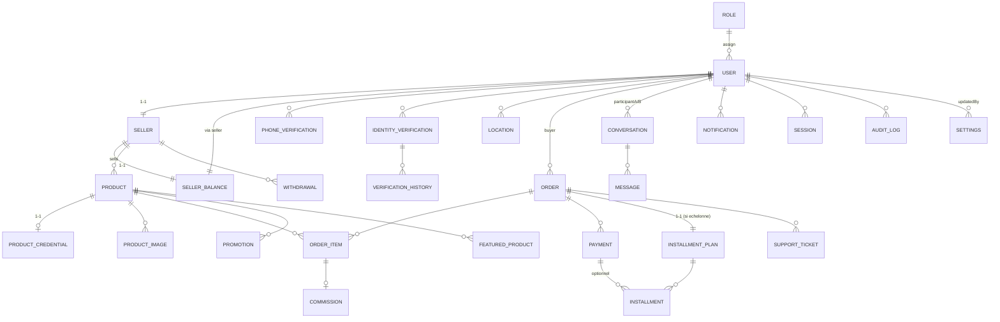

# 03 — Base de données

PostgreSQL 15+ · Prisma 6 · modélisation normalisée (3FN)

Toutes les valeurs monétaires sont stockées en **entiers FCFA** (aucune décimale, pas d'erreur
d'arrondi en virgule flottante). Les identifiants sont des `uuid` générés côté applicatif ou
base. Les horodatages `DateTime` en UTC.

Chaque table porte `createdAt` / `updatedAt`. La suppression d'utilisateurs se fait par
`softDelete` (champ `deletedAt`) pour préserver l'intégrité des soldes/commandes/l'audit.

---

## 1. Modèles

### 1.1 RBAC & comptes

**Role** — 4 rôles (cf. docs/04)
- `id uuid PK`
- `name` : `CLIENT` | `VENDOR` | `STAFF` | `ADMIN` (unique)
- `description`
- `isSystem boolean` (non supprimable)

**User**
- `id uuid PK`
- `roleId → Role` (FK, par défaut CLIENT)
- `email` nullable (l'inscription n'exige que le téléphone)
- `emailVerifiedAt?`
- `phoneNumber` : chaîne **E.164** normalisée, index unique partiel `WHERE deletedAt IS NULL`
- `countryCode` : indicatif (par ex. `+221`)
- `passwordHash?` nullable (comptes Google sans mot de passe)
- `googleSub?`, `googleEmail?` (identifiant Google ssi OAuth)
- `firstName`, `lastName` (nullable avant KYC)
- `birthDate?`, `country?`, `city?`, `address?`
- `status` : `ACTIVE` | `SUSPENDED` | `BANNED`
- `kycStatus` : `NOT_SUBMITTED` | `PENDING` | `IN_PROGRESS` | `VERIFIED` | `REJECTED`
- `verifiedAt?` (date de dernière validation KYC)
- `twoFactorEnabled boolean` (admin)
- `lastLoginAt?`, `lastLoginIp?`
- `deletedAt?` (softDelete)
- `NOTIFICATION_PREFERENCE` (relation 1-1) : inApp, push, email, sms → booléens

**Seller**
- `id uuid PK`
- `userId → User` (unique, 1-1)
- `status` : `APPLICATION_PENDING` (client vérifié qui veut vendre) | `ACTIVE` | `SUSPENDED` | `REVOKED`
- `registrationFeeAmount` (valeur payée au moment de l'activation — historique)
- `registrationPaidAt`
- `sellerSince`
- `approvedBy → User?` (admin), `approvedAt`
- `payoutEligibility?` (infos complètes : cf. docs/01 R3)
- `balance` : relation 1-1 `SellerBalance`

**SellerBalance**
- `id uuid PK`
- `sellerId → Seller` (unique)
- `balancePending` : total des ventes en attente de libération
- `balanceAvailable` : montant retirable
- `totalEarnings` : cumul net encaissé (historique)
- `totalCommissionPaid` : cumul commissions prélevées
- Verrouillage de ligne `SELECT … FOR UPDATE` pour toute mutation (cf. docs/06).

### 1.2 Vérifications

**PhoneVerification**
- `id uuid PK`
- `userId → User`
- `phoneNumber` (E.164), `countryCode`
- `otpCodeHash` (hash du code ; UNE tentaive, hash scrypt), `otpExpiresAt`, `otpAttempts`
- `status` : `UNVERIFIED` | `PENDING` | `VERIFIED`
- `verifiedAt?`, `verifiedAtIp`
- `requestedTimes int` (compteur pour rate-limit)

**IdentityVerification** (dossier KYC)
- `id uuid PK`
- `userId → User`
- `status` : `PENDING` | `IN_PROGRESS` | `VERIFIED` | `REJECTED`
- `documentType` : `NATIONAL_ID` | `PASSPORT` ; `nationalIdNumber?`
- `documentFrontId`, `documentBackId`, `passportId?`, `selfieId` : références **object keys**
  du stockage privé (jamais d'URL)
- `firstName`, `lastName`, `birthDate`, `country`, `city`, `address?` (snapshot au moment du dépôt)
- `submittedAt`, `reviewedAt?`, `reviewedBy → User?`
- `rejectionReason?`, `reviewerNote?`
- `locationId → Location?` (localisation consentie associée au dossier)
- Chaque dépôt crée une nouvelle ligne ; l'ancienne reste dans l'historique.

**VerificationHistory**
- `id uuid PK`
- `verificationId → IdentityVerification`
- `previousStatus`, `newStatus`
- `changedBy → User?`
- `reason?`
- `createdAt`

### 1.3 Localisation

**Location**
- `id uuid PK`
- `userId → User`
- `latitude`, `longitude` (decimal)
- `approximateAddress?`
- `consentGivenAt`, `capturedAt`
- `captureMethod` : `BROWSER_GEOLOCATION` | `MANUAL`
- `revokedAt?` (si l'utilisateur retire son consentement → anonymisation : on supprime lat/lng)

### 1.4 Catalogue

**Product**
- `id uuid PK`
- `sellerId → Seller?` (NULL ⇔ "Administrateur")
- `ownerType` : `ADMIN` | `VENDOR`
- `title`, `slug`, `description`
- `division` : enum (cf. tableau eFootball), `teamPower int`, `playerCount?`, `coins`
- `basePrice` (prix affiché, FCFA)
- `paymentMode` : `ONE_TIME` | `INSTALLMENTS`
- `installmentDownPayment?` int, `installmentMonths?` int (sans si ONE_TIME)
- `status` : `DRAFT` | `PENDING_REVIEW` | `ACTIVE` | `SUSPENDED` | `SOLD` | `ARCHIVED`
- `stock` : 1 (compte unique) — vendu ⇒ SOLD
- `viewCount`, `featuredUntil?`
- `publishedAt`, `reviewedBy?`, `rejectedReason?`
- `deletedAt?`
- Relation `-images`, `-credential 1-1`, `-orders`, `-featured`, `-promotion`

**ProductImage** (captures d'écran — *privées* tant que le produit est en brouillon)
- `id uuid PK`
- `productId → Product`
- `objectKey` (stockage privé), `mimeType`, `sizeBytes`
- `isPrimary boolean`, `position int`

**ProductCredential** (données EXTRA sensibles — jamais renvoyées au catalogue)
- `id uuid PK`
- `productId → Product` (unique, 1-1)
- `efootballEmail` : **chiffré AES-256-GCM**
- `efootballPassword` : **chiffré AES-256-GCM** (ou autre secret)
- `encryptedBy` : version d'algorithme/clé (rotation)
- `lastAccessedAt?`, `lastAccessedBy?` (audit de consultation)

### 1.5 Commandes & paiements

**Order**
- `id uuid PK`
- `orderNumber` (lisible, ex. `MD-2026-XXXXXX`, unique)
- `buyerId → User`
- `status` : `PENDING_PAYMENT` | `PARTIALLY_PAID` | `PAID` | `DELIVERED` | `COMPLETED` | `CANCELLED` | `REFUNDED`
- `paymentMode` : `ONE_TIME` | `INSTALLMENTS`
- `totalAmount` (prix brut appliqué, après promo), `discountAmount`
- `promotionId? → Promotion` (promo appliquée)
- `currency` : `XOF`
- `deliveredAt?` (livraison credentials)
- `message` (client → admin éventuel)

**OrderItem**
- `id uuid PK`
- `orderId → Order`, `productId → Product`
- `productSnapshot` (titre, power, coins, division copiés — immuable), `unitPrice`, `quantity` (=1)

**Payment**
- `id uuid PK`
- `paymentNumber` unique
- `userId → User` (payeur), `orderId? → Order`
- `type` : `ORDER_PAYMENT` | `INITIAL_INSTALLMENT` | `INSTALLMENT` | `SELLER_REGISTRATION_FEE` | `FEATURED` | `WITHDRAWAL?` | `REFUND`
- `amount`, `currency`
- `provider` : `WAVE_LINK` (lien Wave + preuve) | `BALANCE` (mise en avant payée sur solde) | `SYSTEM` (credits/mouvements internes) ; une ancienne valeur reste en base pour l'historique
- `providerReference?` (`wavelink-<paymentNumber>`), `transactionToken` (id idempotence interne, unique)
- `PaymentProof` : capture du reçu Wave, numéro payeur, ID Wave facultatif, statut `PENDING|APPROVED|REJECTED`, vérificateur et motif de refus
- `status` : `PENDING` | `PROCESSING` | `SUCCESS` | `FAILED` | `CANCELLED` | `REFUNDED`
- `failureReason?`, `webhookReceivedAt?`, `verifiedAt?`, `verifiedBy` (SYSTEM)
- `installmentPlanId? → InstallmentPlan`, `installmentId? → Installment`
- `createdAt`, `paidAt?`
- Index unique partiel sur `transactionToken` (idempotence).

**Commission**
- `id uuid PK`
- `orderItemId → OrderItem` (ligne de vente), `sellerId → Seller`
- `orderAmount` (brut), `commissionRate` (snapshot %), `commissionAmount`, `marketingFee?`
- `netToSeller` (solde crédité), `status` : `RECORDED` | `RELEASED` | `REFUNDED`
- `createdAt`, `releasedAt?`

**InstallmentPlan**
- `id uuid PK`
- `orderId → Order` (unique), `productId → Product`
- `totalAmount`, `downPaymentAmount`, `remainingAmount`
- `monthCount`, `monthlyAmount`, `lastMonthAmount?` (pour arrondi)
- `totalPaid` (recoupes), `paidCount`, `status` : `ACTIVE` | `COMPLETED` | `DEFAULTED` | `CANCELLED`
- `dueDateRule` (jour de prélèvement, p.ex. même jour que la commande)

**Installment**
- `id uuid PK`
- `planId → InstallmentPlan`, `index` (1..n)
- `amountDue`, `amountPaid`
- `dueDate`, `paidAt?`
- `paymentId? → Payment`
- `status` : `PENDING` | `PAID` | `OVERDUE` | `WAIVED` | `CANCELLED`
- Index `(planId, status, dueDate)` pour les jobs de rappel/detection.

### 1.6 Finances vendeur

**Withdrawal**
- `id uuid PK`
- `sellerId → Seller`, `requestedBy → User`
- `amount`, `status` : `PENDING` | `APPROVED` | `PROCESSING` | `COMPLETED` | `REJECTED` | `CANCELLED`
- `bankDetailsSnapshot` (infos au moment de la demande), `requestedAt`, `processedAt?`, `processedBy?`
- `rejectionReason?`
- `paymentReference?` (si ordre émis)

(La Commission et le Withdrawal couvrent le volet finances ; `SellerBalance` est la
vue agrégée — le calcul des soldes se fait via des écritures dans `BalanceLedger` le cas
échéant, cf. docs/06 pour l'atomicité.)

### 1.7 Markting — promos & mise en avant

**Promotion**
- `id uuid PK`
- `productId → Product`
- `title`, `discountPercent?`, `promoPrice?` (soit réduction %, soit prix fixe)
- `startsAt`, `endsAt`, `status` : `SCHEDULED` | `ACTIVE` | `EXPIRED` | `CANCELLED`
- `createdBy → User` (admin)
- Contrainte : un seul produit à prix promo actif à la fois (index `(productId, status)` + contrôle applicatif).

**FeaturedProduct**
- `id uuid PK`
- `productId → Product`, `sellerId → Seller`, `purchasedBy → User` (vendeur)
- `days`, `dailyRate` (snapshot), `totalPaid`
- `startedAt`, `expiresAt`, `status` : `ACTIVE` | `EXPIRED` | `CANCELLED` | `REFUNDED`
- `paymentId? → Payment`
- Index `(status, expiresAt)` pour le job d'expiration.

### 1.8 Support

**SupportTicket**
- `id uuid PK`
- `orderId? → Order`, `reporterId → User` (client ou vendeur)
- `category` : `VERIFICATION_CODE` | `PAYMENT_ISSUE` | `DELIVERY` | `OTHER`
- `subject`, `description`
- `status` : `CREATED` | `PENDING` | `IN_PROGRESS` | `RESOLVED` | `CLOSED`
- `assignedTo → User?` (STAFF/ADMIN)
- `resolvedAt?`

(La messagerie recouvre les échanges ; les tickets ajoutent le suivi formel + workflow
`VERIFICATION_CODE` demandé par le §16.)

### 1.9 Messagerie & notifications

**Conversation** — règle §43 : jamais Client↔Vendeur
- `id uuid PK`
- `participantAUserId` (client OU vendeur)
- `participantBUserId` (STAFF/ADMIN uniquement)
- `kind` : `CLIENT_TO_ADMIN` | `VENDOR_TO_ADMIN`
- Contrainte applicative + trigger : si `kind=CLIENT_TO_ADMIN`, alors le rôle de A est CLIENT ;
  si `kind=VENDOR_TO_ADMIN`, le rôle de A est VENDOR. B est toujours STAFF/ADMIN.
- UNIQUE `(participantAUserId, participantBUserId, kind)` — une seule conversation entre les deux.

**Message**
- `id uuid PK`
- `conversationId → Conversation`, `senderId → User`
- `content`, `attachmentKey?` (stockage privé)
- `readAt?`, `createdAt`
- `isSystem boolean` (messages automatiques traçables)

**Notification**
- `id uuid PK`
- `userId → User`
- `type` : (enum, cf. docs/07 §notifications)
- `title`, `message`, `actionUrl?`, `readAt?`, `createdAt`
- `channel` : `IN_APP` | `EMAIL` | `SMS` | `PUSH`
- `priority` : `LOW` | `NORMAL` | `CRITICAL`

### 1.10 Sécurité & audit

**Session**
- `id uuid PK`
- `userId → User`
- `tokenHash` (hash du sid — jamais stocké en clair), `kind` : `COOKIE` | `BEARER`
- `userAgent?`, `ip`, `expiresAt`, `lastActiveAt`, `revokedAt?`, `revokedBy?`
- `isAdminSession boolean` (pour renforcer les durées admin)
- Index `(userId)` et unique partiel `(tokenHash)` active.

**AuditLog**
- `id bigserial PK`
- `userId? → User`, `sessionId?`, `ip?`, `userAgent?`
- `actorRole?`, `action` (enum étendu : `LOGIN`, `LOGOUT`, `KYC_VERIFY`, `ROLE_CHANGE`,
  `PRODUCT_CREATE`, `PRODUCT_PRICE_CHANGE`, `SENSITIVE_DATA_ACCESS`, `PAYMENT_SUCCESS`,
  `REFUND`, `WITHDRAWAL_CREATE`, `SETTINGS_CHANGE`, …)
- `resourceType`, `resourceId`, `metadata` (JSONB : ancienne/nouvelle valeur, delta)
- `severity` : `INFO` | `WARNING` | `CRITICAL`
- `createdAt`, index `(action)` et `(resourceType, resourceId)`.

**Settings**
- `id uuid PK`
- `key` unique, `value` JSONB, `type`, `group`
- `updatedBy → User?`, `updatedAt`
- (exemples : `sellerRegistrationFee=1000`, `sellerCommissionPercent=15`,
  `featuredDailyRate=200`, `maxInstallments=8`, `payoutHoldDays=3`, …)

---

## 2. Contraintes transverses

2.1 **Téléphone unique** : index unique partiel `phoneNumber` où `deletedAt IS NULL`.
2.2 **`creditBalance` verrouillable** : tous les mouvements de solde dans une transaction SQL
     avec `SELECT … FOR UPDATE` sur `SellerBalance` (pas d'UP.serialize de champ, cf. docs/06).
2.3 **Total payé = prix exact** : les plans d'échéances sont générés côté serveur avec
     vérification `SUM(installments) + downPayment == totalAmount` avant insert dans le même
     `tx` (voir algorithme docs/06).
2.4 **Sensibles jamais exposés** : `ProductCredential` et clés de documents KYC non incluses
     dans les projections publiques/scopes Prisma (`select`/`include` explicites).
2.5 FK sur suppression : `RESTRICT` pour l'historique financier ; `CASCADE`/`SET NULL`
     uniquement pour les données éphémères.

---

## 3. Index — catalogue, recherche, filtres

Pour les requêtes du catalogue (§29), pagination par curseur (`(status, publishedAt DESC, id)`) :

| Table / objectif | Index |
|---|---|
| Recherche rapide par nom | `Product(title)` + trigram `pg_trgm` (recherche floue) |
| Catalogue actif trié date | `Product(status, publishedAt DESC, id)` |
| Filtre prix | `Product(status, basePrice)` |
| Filtre power / division | `Product(status, teamPower)`, `Product(status, division)` |
| Filtre pièces | `Product(status, coins)` |
| Filtre mise en avant | `FeaturedProduct(status, expiresAt)` |
| Promotions actives | `Promotion(status, startsAt, endsAt)` |
| Filtre vendeur | `Product(sellerId, status)` |
| Paiements webhook | UNIQUE `Payment(transactionToken)`, `Payment(providerReference)` |
| Échéanciers client | `InstallmentPlan(userId?→Order, status)`, `Installment(planId, status, dueDate)` |
| Sessions actives | UNIQUE partiel `Session(tokenHash) WHERE revokedAt IS NULL`, `Session(userId)` |
| Notifications non-lues | `Notification(userId, readAt)` |
| Messagerie | `Conversation(participantAUserId, kind)`, `Message(conversationId, createdAt)` |
| KYC en attente (admin) | `IdentityVerification(status, submittedAt)` |
| Ventes vendeur | `OrderItem(sellerId, status)` via Product → ou colonne `sellerId` dénormalisée si nécessaire |

> Stratégie : préfixer TOUTES les requêtes catalogue par `status='ACTIVE'` — un index composé
> commençant par `status` fait de ce filtre un accès d'index. Le nombre de produits actifs
> étant borné, la pagination restera très rapide avec un grand volume.

---

## 4. ERD (mermaid)

